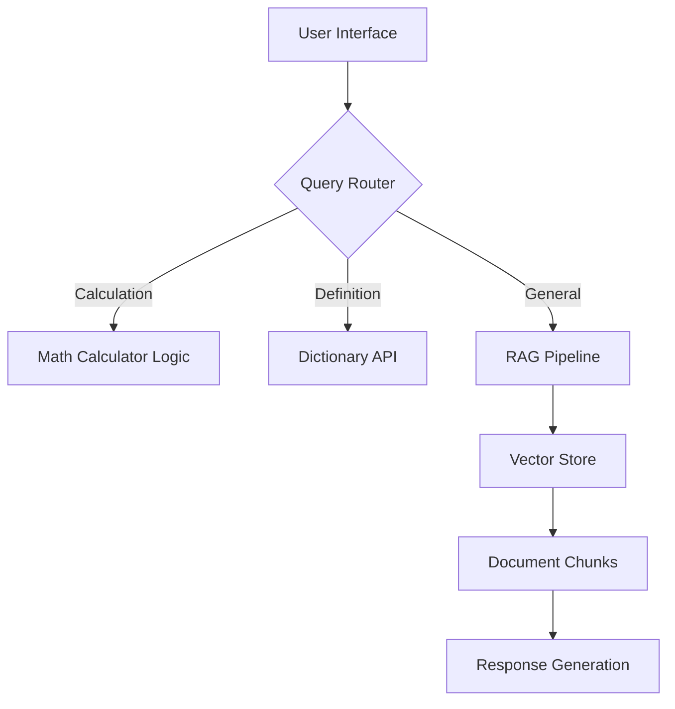

# RAG-Powered Multi-Agent Knowledge Assistant 🤖

A sophisticated question-answering system combining Retrieval-Augmented Generation (RAG) with agentic workflows, featuring:

- **Document-based Q&A** 📄
- **Calculations** 🧮 
- **Definitions** 📖
- **Interactive Streamlit UI** 💻

## Features ✨

- **Multi-Agent Workflow**:
  - Automatic routing to appropriate handler (RAG/Calculator/Definition)
  - Decision logging for transparency
- **Document Management**:
  - TXT file upload capability
  - Dynamic index rebuilding
  - Chunking with configurable overlap
- **RAG Pipeline**:
  - FAISS vector store with HuggingFace embeddings
  - Context-aware responses with source attribution
- **User Interface**:
  - Session history tracking
  - Visual document source display
  - Real-time processing metrics

## Installation ⚙️

```bash
# Clone repository
git clone https://github.com/iamAni9/RAG-Powered-Multi-Agent-Q-A-Assistant.git
cd RAG-Powered-Multi-Agent-Q-A-Assistant

# Setup environment 
python -m venv {your environment name}
.\myenv\Scripts\activate **for activating**

# Install dependencies
pip install -r requirements.txt

# create .env file and paste this code
GROQ_API_KEY=**Your Groq Cloud API key**
FREE_DICTIONARY_API=https://api.dictionaryapi.dev/api/v2/entries/en

# run the code
python main.py **for terminal**
streamlit run app.py **for web UI**
```
## Example Queries

> Calculate 18% of 3450  
> Define quantum entanglement  
> Explain the Starlink status in India. *(document-dependent)*

## Architecture 🏛️


